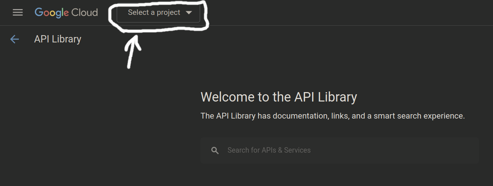

## To create Google API Key (JSON-file) you need:
### 1) Register on [Google Cloud](https://cloud.google.com/artifact-registry)
### 2) Create [new project](https://console.cloud.google.com/projectcreate?previousPage=%2Fapis%2Flibrary%3Fproject%3Dconcise-ion-399020&organizationId=0) (use existing project if you want)
### 3) Go to project's [manage](https://console.cloud.google.com/apis/library) and select your new project

### 4) Open Navigation Menu and choose "IAM & Admin" -> "Service accounts"
### 5) Create service account (you can use existing service account if you want) 
### 6) Choose in list your service account and go to "Actions" -> "Manage keys"
### 7) Add key (Create new key) and download JSON-file with API-key

<br><hr>

## Link Google API key:
### After when you have Google API key you should:
### 1) Rename your JSON to "service_account_access.json"
### 2) Move it to "/full/path/to/project/data/service_account_access.json"
### 3) Open "/full/path/to/project/data/constants.py"
### 4) Set "SERVICE_ACCOUNT_FILE" to "/full/path/to/project/data/service_account_access.json"
### 5) Add "SCOPES" (recommend: "https://www.googleapis.com/auth/drive")
### 6) Run this code to get all files on your Google Drive:
```python
from google.oauth2 import service_account
from googleapiclient.discovery import build

# registrate your service acc to use in Python
SCOPES = ['https://www.googleapis.com/auth/drive']
SERVICE_ACCOUNT_FILE = '/full/path/to/project/data/service_account_access.json'
credentials = service_account.Credentials.from_service_account_file(
        SERVICE_ACCOUNT_FILE, scopes=SCOPES)
service = build('drive', 'v3', credentials=credentials)

# get all files on your Google Drive (change pageSize, if you need see more/less files)
results = service.files().list(
    pageSize=10,
    fields="nextPageToken, files(id, name, mimeType)"
).execute()
print(results)
```
### 7) Choose from getting files list just that you have in "root" dir on your Google Drive
### 8) Add it to "ROOT_CONTENT" by schema:
```python
ROOT_CONTENT = [
    (
        'dir',  # or 'file'
        'name',  # name your file/dir
        'long_id'  # id of your file/dir
    ),
    # ...
]
```
### 9) Alright!

<br><hr>

## You can remove "/full/path/to/project/screen_proj_manage.png", it's just for good README

<br><hr>

## Supported commands:
### 1)  ! "sys command"
### 2)  ls
### 3)  pwd
### 4)  cd "path"
### 5)  mkdir "name"
### 6)  rename ./"old_name" ./"new_name"
### 7)  put "file name"
### -)  put -r "dir name"
### 8)  get "file name"
### -)  get -r "dir name"
### 9)  r
### 10) "command 1" && "command 2"
### 11) help
### 12) rm (just for files created by service account)
### 13) history

<br><hr>

## By last update I've added the ability to use keyboard arrows just like in the terminal.
## That is, "RIGHT" and "LEFT" arrows manage the carriage location and "UP" and "DOWN" arrows help you switch between command history
